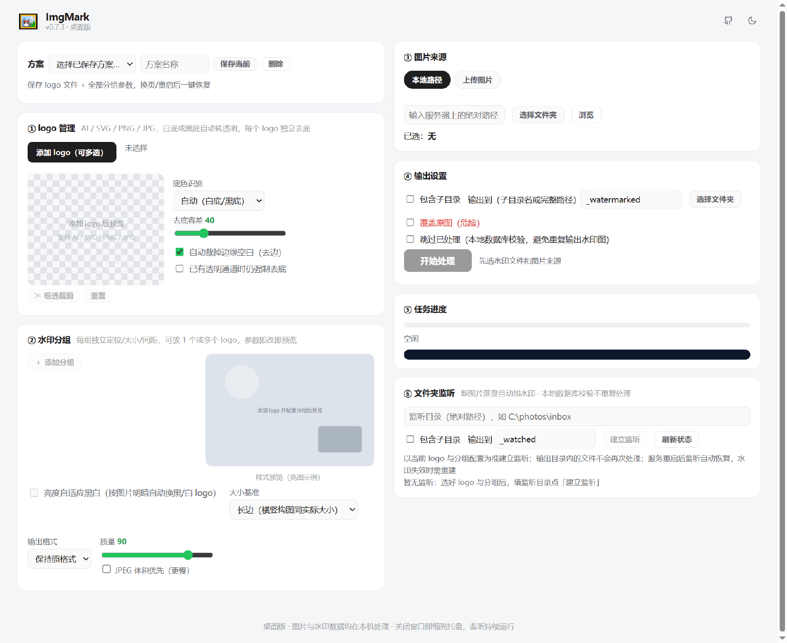
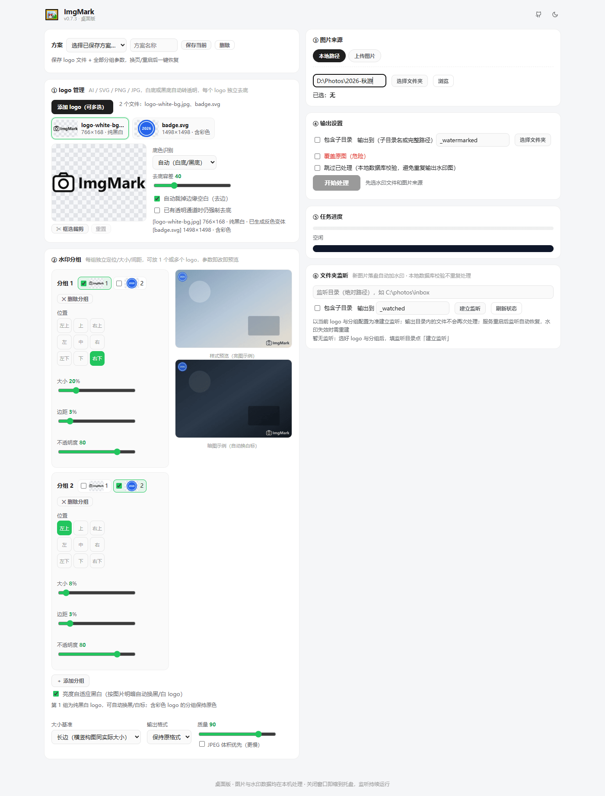

<div align="center">


# ImgMark 批量图片水印

**logo 白底 / 黑底自动去底，分组布局，按图片明暗自动换黑白标，一键给整个文件夹加水印**

[](https://github.com/techysy/imgmark/releases/latest)
[](https://github.com/techysy/imgmark/actions/workflows/ci.yml)
[](https://github.com/techysy/imgmark/releases)
[](#下载)
[](https://nodejs.org/)
[](LICENSE)

[下载](#下载) · [功能](#功能) · [快速开始](#快速开始) · [CLI](#cli-用法) · [HTTP API](#http-api) · [更新日志](CHANGELOG.md) · [Agent 手册](AGENTS.md)



</div>

## 效果示例

同一套配置批量处理：右下角是白底 JPG 自动去底得到的黑白文字 logo，开启「亮度自适应黑白」后**亮图自动用黑标、暗图自动换白标**；左上角的彩色徽标单独一组，保持原色。


<details>
<summary><b>使用中的界面</b>（两个分组 + 亮/暗双预览）</summary>



</details>

## 下载

从 [**Releases**](https://github.com/techysy/imgmark/releases/latest) 下载对应平台的安装包：

| 平台 | 文件 | 说明 |
| --- | --- | --- |
| Windows | `ImgMark-Setup-<版本>.exe` | 安装版（推荐） |
| Windows | `ImgMark-Portable-<版本>.exe` | 便携版，免安装 |
| macOS（Apple Silicon） | `ImgMark-mac-arm64-<版本>.dmg` | M1 及以后的芯片 |
| macOS（Intel） | `ImgMark-mac-x64-<版本>.dmg` | Intel 芯片 |
| 飞牛 fnOS | `imgmark-<版本>-window.fpk` | **推荐**：桌面窗口入口，全功能 |
| 飞牛 fnOS | `imgmark-<版本>-fullscreen.fpk` | 全屏 / 新标签页入口，全功能 |
| 飞牛 fnOS | `imgmark-<版本>-compat.fpk` | 兼容旧版应用中心，无飞牛授权目录功能 |

> macOS 安装包未做代码签名：首次打开请**右键 → 打开**，或执行 `xattr -cr /Applications/ImgMark.app`。
> 飞牛 fnOS 要求系统 ≥ 1.2.0401、应用中心 ≥ 1.34.0（window / fullscreen 变体），安装时自动安装依赖应用 nodejs_v24。

## 工作流程

<div align="center">

<picture>
  <source media="(prefers-color-scheme: dark)" srcset="docs/workflow.svg">
  
</picture>

</div>

## 功能

**水印源处理**
- **格式**：`.ai`（PDF 兼容模式，可选 Ghostscript 兜底）、`.svg`、`.png`、`.jpg/.jpeg`、`.webp`、`.bmp`、`.gif`、`.tif/.tiff`、`.avif`
- **自动去底**：从边缘识别底色（白 / 黑），只清除与边缘连通的背景，logo 内部的同色内容不受影响；边缘羽化 + 去色染，消除白边 / 黑边；容差可调
- **裁剪**：预览图上拖拽框选保留区域；或按内容包围盒自动裁掉四周空白
- **多 logo**：可多选，每个 logo 独立去底，再自由组合进不同分组

**布局与合成**
- **水印分组**：可建多个分组，每组独立设置九宫格位置、logo 组合、横排 / 竖排、间距、大小、边距、不透明度和逐 logo 比例；改任一参数立即重新预览（亮 / 暗两张示例图）
- **亮度自适应黑白**：纯黑白 logo 所在的分组，按水印落点区域的亮度自动选黑标或白标；彩色 logo 所在分组保持原色
- **大小基准**：长边（默认，同一相机横 / 竖构图水印实际大小一致）/ 短边 / 图宽
- **其他**：平铺、旋转、EXIF 自动摆正、保留 EXIF / ICC 元数据

**批量与自动化**
- **三种图片来源**：本地文件夹、直接上传、飞牛 fnOS 授权目录
- **批量处理**：递归子目录、并发处理、保持原格式或转 PNG / JPEG / WebP；默认输出到 `<目录>/_watermarked/`，不改动原图（可选覆盖）
- **文件夹监听**：新图片落盘自动加水印（文件事件 + 周期扫描双保险，防半写、防回环），服务重启自动恢复
- **本地数据库去重**：按「路径 + 修改时间 + 大小」记录已输出的图片，批量与监听都能跳过已处理的文件
- **方案保存**：logo 文件 + 全部分组布局 + 全局参数一键保存，下拉选择即可恢复
- **CLI 与 HTTP API**：不开界面也能批量处理，方便脚本和 AI Agent 调用（见 [AGENTS.md](AGENTS.md)）

## 快速开始

### 桌面版（Windows / macOS）

从 [Releases](https://github.com/techysy/imgmark/releases/latest) 下载安装即可。

- 使用系统原生文件对话框：多选图片直接处理本地路径（不经过上传）、选择文件夹、按扩展名过滤水印源
- 关闭窗口后缩到**系统托盘**常驻，文件夹监听继续运行；托盘菜单可显示主窗口、查看监听数量、退出
- 内嵌服务只监听本机（`127.0.0.1`），默认端口 28110，被占用时自动顺延；已有 ImgMark 实例则直接复用

### 飞牛 fnOS

1. 从 Releases 下载 fpk（推荐 `window` 变体），放到应用中心扫描目录（如 `/vol1/1000/fnOS App/fpk/imgmark/`），在应用中心「手动安装」
2. 打开应用 →「图片来源」→「飞牛授权目录」→「＋ 选择并授权目录」
   - **个人目录**（所有用户可用）：选中即完成授权
   - **共享目录**（仅管理员）：授权给整个应用
3. 浏览并选择图片目录，开始处理；结果写入该目录下的 `_watermarked` 子目录

> 独立浏览器（非 fnOS 桌面）打开时无法发起新授权，但此前授权过的目录可以正常使用。
> 安装报「设置目录权限失败」时改用 `compat` 变体（该变体无飞牛授权目录功能，请用本地路径或上传）。

### 从源码运行（任意系统）

需要 Node.js ≥ 18。

```bash
git clone https://github.com/techysy/imgmark.git
cd imgmark/app/server
npm install
npm start          # 打开 http://127.0.0.1:28110
```

非 fnOS 环境下「飞牛授权目录」页签不可用，用「本地路径」或「上传图片」即可。端口可用 `PORT=28120 npm start` 修改。

> ImgMark 尚未发布到 npm 仓库。需要程序化调用时，可在本仓库中 `require('./app/server')`，导出 `prepareWatermark` / `composeWatermark` / `composeGroups` / `buildGroupWatermark` / `mergeWatermarks` / `analyzeInk`。

## CLI 用法

```bash
cd app/server

# 多个 logo 并排合并成一个透明 PNG
node bin/wm.js prepare brand.png partner.ai --merge -o combined.png --gap 10

# 批量加水印（水印源自动先转透明 PNG；-w 可重复 = 多 logo 并排）
node bin/wm.js apply -w brand.png -w partner.png -i /path/to/photos \
  --pos se --size 20 --opacity 80 --margin 3 --recursive \
  --format auto --quality 90 -o /path/to/photos/_watermarked

# 启动 Web 界面
node bin/wm.js serve
```

常用参数：

| 参数 | 说明 |
| --- | --- |
| `--pos nw\|n\|ne\|w\|c\|e\|sw\|s\|se` | 位置（默认 `se` 右下） |
| `--size 20` / `--opacity 80` / `--margin 3` | 大小（占宽 %）/ 不透明度 / 边距（占短边 %） |
| `--tile --tile-gap 10` | 平铺 + 间距 % |
| `--rotate 30` | 水印旋转角度 |
| `--crop "55,55,40,40"` | 裁剪水印源：从 x,y 起取 w×h（百分比）；多 logo 用分号分隔，空段表示不裁 |
| `--trim` | 自动裁掉水印源边缘空白 |
| `--format auto\|png\|jpeg\|webp --quality 90` | 输出格式与质量 |
| `--mozjpeg` | JPEG 体积优先：小约 10–15%，但编码慢约 5 倍 |
| `--overwrite` | 覆盖原图（危险，不可恢复；此时强制保持原格式） |
| `--bg auto\|white\|black --tolerance 40 --force` | 去底参数 |
| `--concurrency 3 --suffix _wm` | 并发数 / 输出文件名后缀 |

CLI 暂不支持分组布局、文件夹监听和数据库去重，这三项请用 Web 界面或 HTTP API。

## HTTP API

> 🤖 给 AI Agent 用的完整操作手册（含可直接复制的 curl 示例）见 [AGENTS.md](AGENTS.md)。

| 方法 | 路径 | 说明 |
| --- | --- | --- |
| POST | `/api/prepare` | multipart `watermark`（可多个）。**分组模式**（`split=true`）：每个 logo 独立去底，返回 `{id, logos:[…]}` 供 `groups` 引用；**合并模式**（默认）：多 logo 并排合成一个透明 PNG。参数：`bg / tolerance / force / maxSize / trim / crop / gap / equalHeight` |
| POST | `/api/preview` | `{watermarkId, options, groups, orient}` → 内置示例图的合成预览（`orient` 可选 `landscape`/`portrait`，默认横图）；开启亮度自适应时额外返回暗图预览 `previewAuto` |
| POST | `/api/process` | multipart：`payload`（JSON）+ 可选 `files[]`；`mode=local / upload / local-files / fnos` → `{jobId}`；`skipProcessed:true` 跳过已处理文件 |
| GET | `/api/jobs/:id` | 任务进度（逐文件实时更新）与逐文件结果 |
| GET | `/api/jobs/:id/file/:idx` | 上传模式下载单个结果 |
| GET / POST | `/api/watchers` | 文件夹监听列表 / 建立监听 `{inputDir, outputDir?, recursive?, watermarkId, groups, options}` |
| DELETE | `/api/watchers/:id` | 删除监听 |
| POST | `/api/watchers/:id/rescan` | 立即全量扫描 |
| GET | `/api/db/stats` | 本地数据库记录数 |
| GET / POST | `/api/presets` | 方案列表 / 保存方案（multipart：`logos` 原文件 + `payload` JSON `{name, groups, options}`；同名覆盖） |
| GET | `/api/presets/:id/file/:idx` | 下载方案中第 idx 个 logo 原文件 |
| DELETE | `/api/presets/:id` | 删除方案（连同拷贝的 logo 文件） |
| POST | `/api/browse` | 本地目录浏览 |
| GET | `/api/fnos/status` · `/api/fnos/folders` | fnOS 开放 API 可用性 / 已授权目录 |
| POST | `/api/fnos/list` · `/api/fnos/delete-authorization` | 列授权目录内容（先做 ACL 校验）/ 删除授权 |

`options`：`position, sizePct, opacity, marginPct, offsetX, offsetY, rotate, tile, tileGapPct, format(auto|png|jpeg|webp), quality, mozjpeg, autoColor, sizeBase(long|short|width)`

`groups`：`[{logos:[序号], position, sizePct, marginPct, direction(h|v), gapX, gapY, ratios[], opacity, offsetX, offsetY}]`。每个分组先把组内 logo 按方向、间距和比例拼成组合水印，再按 `sizePct`（占大小基准边 %）缩放、按 `position` 落位；开启 `autoColor` 时，组内 logo 全为纯黑白的分组按落点亮度整组切换黑 / 白标。

## 项目结构

```
imgmark/
├── app/
│   ├── server/                    Node 服务（唯一 package.json）
│   │   ├── bin/wm.js              CLI
│   │   └── src/
│   │       ├── server.js          Express 路由、任务与水印状态
│   │       ├── core/
│   │       │   ├── transparency.js  底色识别 / 洪泛去底 / 羽化去色染
│   │       │   ├── watermark.js     水印准备、分组拼合、合成、编码
│   │       │   ├── batch.js         目录扫描、并发池、输出路径与重名处理
│   │       │   ├── watcher.js       文件夹监听
│   │       │   └── db.js            本地处理数据库（去重）
│   │       ├── formats/
│   │       │   ├── ai.js            .ai → PNG（pdfjs，Ghostscript 兜底）
│   │       │   └── bmp.js           BMP 编解码
│   │       ├── fnos/                fnOS 开放平台客户端与 /api/fnos/* 路由
│   │       └── public/              单页前端
│   └── ui/                        fnOS 桌面入口配置与图标
├── desktop/                       Electron 桌面壳（托盘、原生对话框）
├── cmd/ · config/ · wizard/       fnOS 生命周期脚本、权限声明、设置向导
├── manifest · VERSION             fpk 清单与版本号
├── scripts/                       冒烟测试、Release 正文生成、fpk 打包、图标生成
└── docs/images/                   README 配图
```

<details>
<summary><b>开发者：桌面版与 fpk 本地打包</b></summary>

**桌面版**

```bash
cd desktop && npm install && npm run dev    # 开发
npm run dist                                # 打包 → dist/
```

前端检测到 `window.imgmarkDesktop` 后自动启用原生对话框：水印文件选择走原生对话框、「上传图片」变为本地文件路径直处理、「本地路径」页签出现「选择文件夹」按钮；纯浏览器环境自动降级。

**fpk**

```bash
./scripts/build-fpk.sh x86     # 需在 Linux 上运行（sharp 等依赖是平台相关二进制）；ARM 用 arm
```

- `manifest` 声明 `install_dep_apps = nodejs_v24`、`micro_app = true`（启用 JS SDK 必需）
- `config/resource` 声明 api-scope：`trim.file.userAccess` / `trim.file.sharedAccess` / `trim.file.userAcl` / `trim.file.path` / `trim.system.getPlatformConfig`
- 服务端口 28110（`TRIM_SERVICE_PORT` 可覆盖），数据目录 `TRIM_PKGVAR`

**fnOS 后端 API 调用约定**（`src/fnos/trimapp.js` 已封装）：`POST /api/v1/trimapp`，经 Unix Socket `/var/run/trim_open_gateway_apiscope.socket`，`Authorization: Bearer ${TRIM_API_TOKEN}`（系统注入，每次现读不落盘），请求体 `{reqId, req, appName, data}` → `{code, msg, data}`。

**发版**

1. 在 [CHANGELOG.md](CHANGELOG.md) 顶部补充新版本小节
2. 更新 `VERSION`、`manifest`（version / changelog）、`app/server/package.json`、`desktop/package.json` 中的版本号
3. 推送 `v*` tag：CI 自动构建 Windows / macOS / fpk 安装包，并从 CHANGELOG 生成 Release 正文（缺少对应小节时构建会失败）

</details>

## 已知限制

- Web 界面无鉴权，属局域网工具，请勿直接暴露到公网（远程访问建议走 FN Connect + fnOS 侧访问控制）
- `.ai` 需以「创建 PDF 兼容文件」方式保存；纯 PostScript 的旧版 AI 需要系统安装 Ghostscript
- BMP 不支持 RLE 压缩格式
- 服务重启后需重新选择 logo 或恢复方案（处理后的水印缓存在临时目录，映射关系在内存中）；文件夹监听会转为暂停，需重新建立
- 「方案」保存在服务端数据目录（`dataDir/presets`，logo 原文件会拷贝一份进去），换浏览器、清缓存、重启后仍可用；恢复方案时会自动重新准备水印
- 飞牛目录授权为单选（平台限制）
- 大小基准按比例计算：混用不同分辨率的图片时，水印像素尺寸会随分辨率缩放

## 测试

```bash
cd app/server && npm install && cd ../..
node scripts/smoke-test.js    # 26 项：去底 / 合成 / 批量 / CLI / HTTP / 分组 / 监听 / 去重 / BMP 等全链路
```

## 许可证

[MIT](LICENSE)
